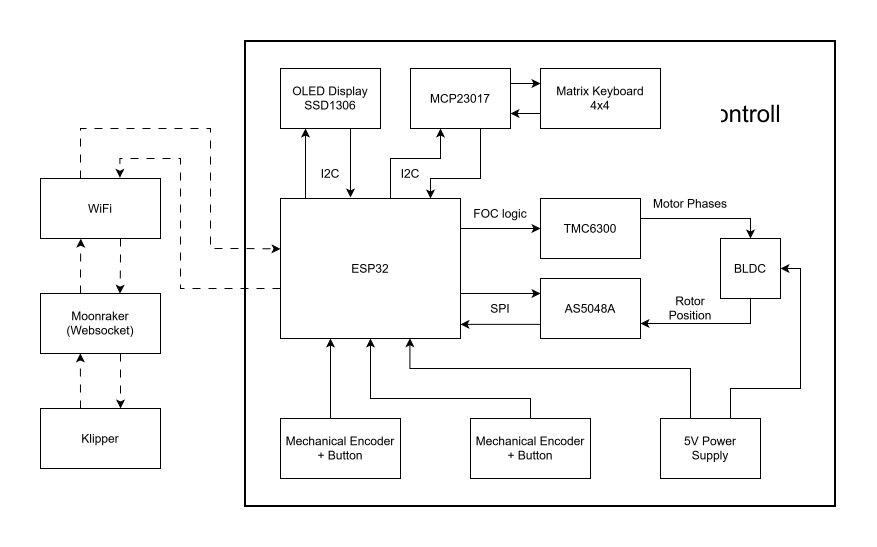
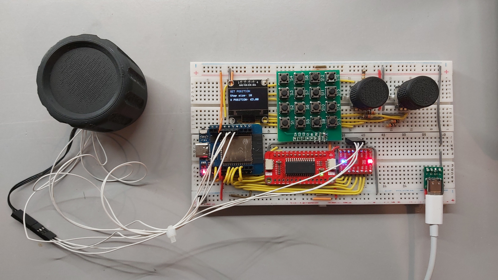

# 3D Printer Controller

## Introduction

*This repository presents an early prototype of the controller. A custom PCB is planned as the next development step, replacing the breadboard setup.*[^1]

This project aims to create a macropad-like device with a gimbal BLDC motor–based haptic knob as its primary control element. In addition to the haptic knob and the 4×4 keyboard matrix, the controller also includes an OLED display and two mechanical encoders.

Most 3D printers ship with a simple LCD and a single mechanical encoder, which makes navigation slow and unintuitive. This controller aims to provide a more user-friendly, faster, and highly customizable way to control a 3D printer.

Users can define custom G-codes and macros and trigger them using hotkeys.
The haptic knob is intended for tasks such as:

- axis jogging  
- temperature adjustments  
- tool selection  
- Z-offset tuning  
- feedrate / flow changes  
- and more  

The step size for parameter changes can be adjusted using one of the mechanical encoders. The second encoder is used for navigating through menus displayed on the OLED screen.

Depending on the firmware, the controller can serve multiple purposes — not only for 3D printers, but also as a general control surface for other devices or Home Assistant.

---

## Implementation

### Haptic Element

The haptic control element is based on an outer-rotor gimbal BLDC motor, chosen for its high torque and suitability for direct-drive applications.  
The motor is driven by a [TMC6300](datasheets/TMC6300.pdf), a compact, low-voltage, and highly efficient 3-phase driver.  
Rotor position is measured using the [AS5048A](datasheets/as5048.pdf), a 14-bit magnetic angle sensor that provides precise feedback for torque and position control.

The haptic behavior is implemented using the [SimpleFOC](https://simplefoc.com) library, which handles the Field-Oriented Control (FOC) algorithms.

The BLDC motor is used to generate programmable haptic effects such as:

- detents  
- dynamic torque feedback  
- virtual resistance / friction  
- end-stops corresponding to printer limits or menu boundaries  

### Other Components

I chose to use an ESP32 module because it has integrated Wi-Fi, which simplifies the design.  
For the future PCB version, I will have to use an ESP32 module with a homologation/CE-certified RF design.

The implementation of the remaining components is straightforward.  
An I/O expander is required because the TMC6300 and the keyboard matrix alone comsume 14 I/O pins.  
A simplified block diagram is shown below:

---

## Current Features

- Users are prompted to enter Wi-Fi credentials, printer host, port, and custom hotkeys via a configuration access point at first startup  
  (for the password, users can scan an included QR code).  
- Users can reopen the configuration menu by pressing the left encoder for 3 seconds.  
- Keyboard hotkeys are functional.  
- Step size can be adjusted using the left encoder.  
- The right encoder is used for display/menu navigation.  
- The haptic knob can be used to increase or decrease the X-axis position.

### Prototype Photo

### Demo
 
[Video](https://drive.google.com/file/d/1ionz915SD3VQXqB1Lr0lfkvmCnSRa0wJ/view?usp=sharing)

[^1]: This version of the project serves as a proof of concept. Features are intentionally limited and primarily intended to validate the hardware functionality.
